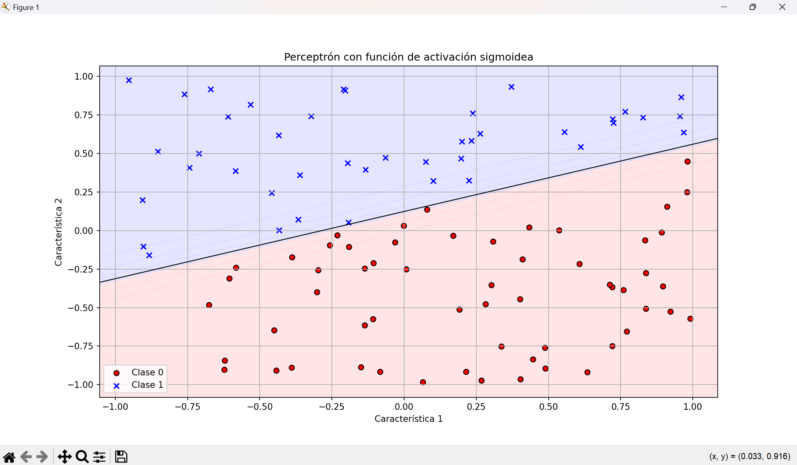

# Perceptrón con Función de Activación Sigmoidea

Este proyecto implementa un perceptrón que utiliza la función de activación sigmoidea para clasificar puntos en un plano bidimensional. Esta implementación permite visualizar cómo el perceptrón aprende a separar dos clases de datos mediante una frontera de decisión lineal.

## Características

- Implementación de la función de activación sigmoidea
- Clase `PerceptronSigmoide` completa con métodos de inicialización, activación y entrenamiento
- Generación de datos sintéticos para demostración
- Visualización de la frontera de decisión y puntos clasificados
- Seguimiento del error durante el entrenamiento

## Requisitos
numpy
matplotlib

## Uso

Para ejecutar el código:

```bash
python perceptron_sigmoide.py
```

## El programa:

Genera 100 puntos aleatorios en un plano bidimensional
Asigna clases basadas en su posición relativa a una línea
Entrena un perceptrón para clasificar estos puntos
Muestra la visualización de los resultados
Imprime los pesos finales y prueba algunos ejemplos

Explicación del código
Función Sigmoidea

```bash
def sigmoidea(x):
    return 1 / (1 + np.exp(-x))
```

La función sigmoidea transforma cualquier valor real en un valor entre 0 y 1, permitiendo una salida continua en lugar de binaria.

### Clase PerceptronSigmoide

Esta clase implementa:

- **`__init__(self, n_inputs)`**: Inicializa el perceptrón con pesos aleatorios
- **`activar(self, entradas)`**: Calcula la salida del perceptrón para un conjunto de entradas
- **`entrenar(self, entradas, salidas_esperadas, tasa_aprendizaje, iteraciones)`**: Entrena el perceptrón usando descenso de gradiente

### Visualización

La función `graficar_resultados()` muestra:
- Los puntos de entrenamiento coloreados por clase
- La frontera de decisión (línea negra)
- Regiones coloreadas que indican las zonas de clasificación

## Resultados

Después del entrenamiento, el perceptrón aprende una frontera de decisión que separa efectivamente los puntos en dos clases:

- Clase 0: Puntos rojos (por debajo de la frontera de decisión)
- Clase 1: Puntos azules (por encima de la frontera de decisión)



La frontera aprendida se aproxima a la función lineal utilizada para generar los datos originales.

## Aplicaciones

Este tipo de perceptrón puede utilizarse para:
- Problemas de clasificación binaria linealmente separables
- Introducción a conceptos básicos de redes neuronales
- Demostración visual de aprendizaje automático

## Licencia

Libre para uso educativo y personal.
